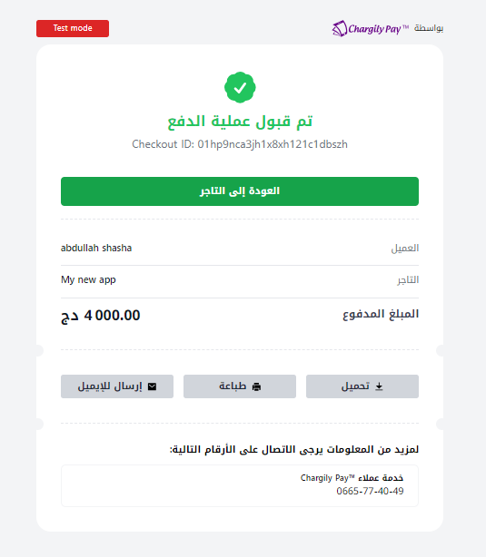
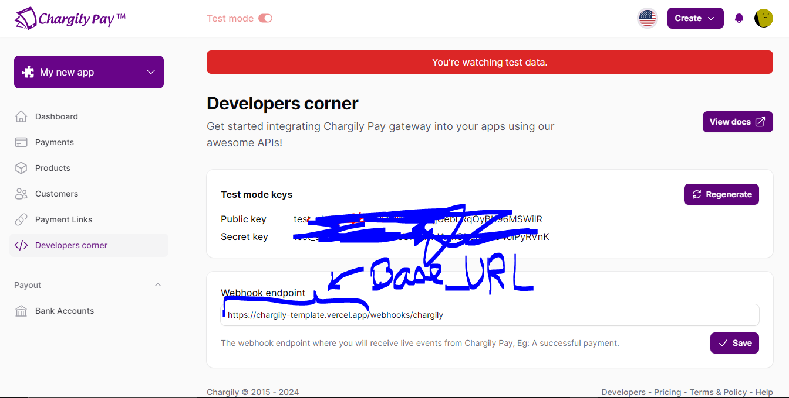

# How to Use Chargily Payment Gateway in Your Next.js Application




## Clone the Repository

To get started with integrating Chargily payment gateway into your Next.js application, you can follow these steps:

1. Clone the repository to your local machine using the following command:

```bash
git clone https://github.com/chrhi/chargily-template.git
```

## Install Dependencies

use your favorate package manager to install all the depandencies

## Set Environment Variables

create .env file and copy the content in .env.example into .env you have just created

## deploy your project

the easiest is vercel but you can use amazon if you know what you are doing and it is cheaper

## add webhook end point

hadi lazam tdir project ta3ak fi verlel wala dir localhost manba3d tzid webhooks/chargily
ida mazakch faham hadi wach tdir 7awass kifah wabhook yamcho fi youtube tafham

almohim lazam tdir baseurl + /webhooks/chargily

hadi /webhooks/chargily path fi repo hada ta3dar tbadalha kima t7ab

hadi taswira win t7ato


